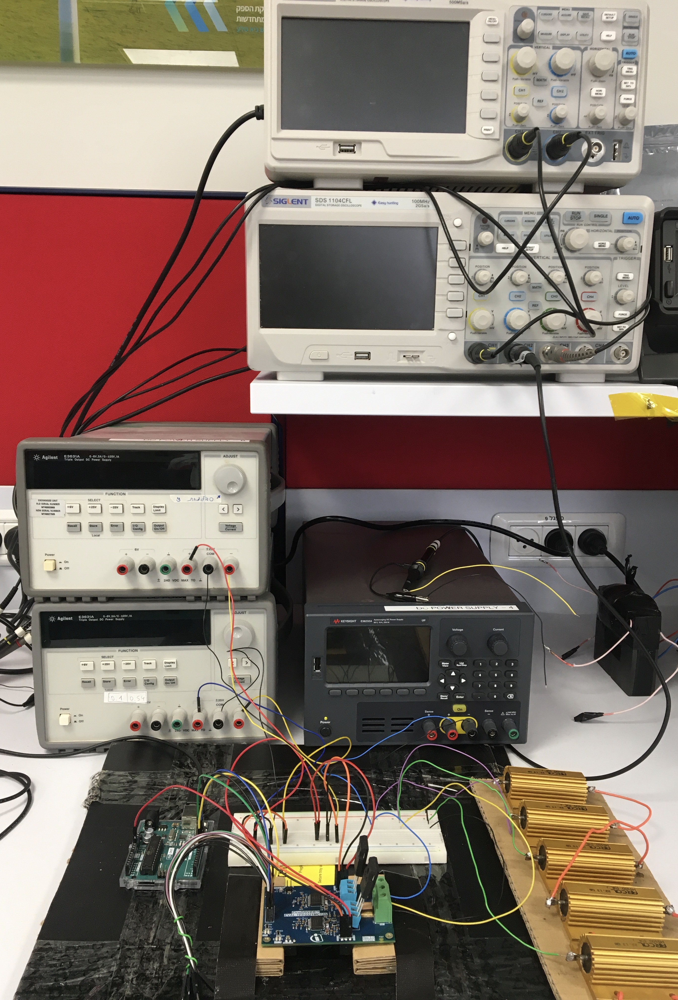
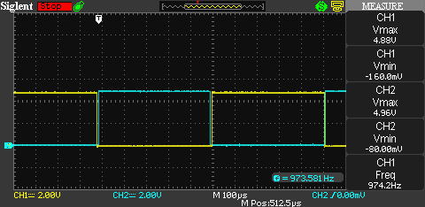
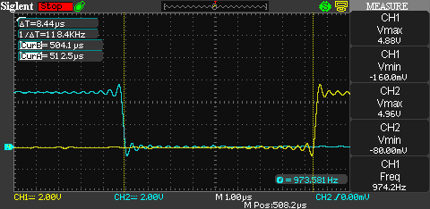
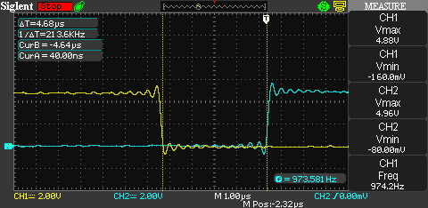
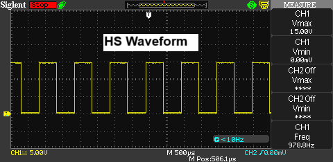
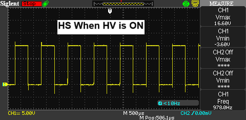
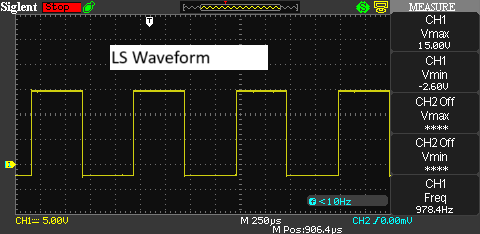
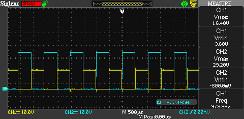
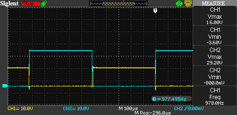

# Generic Gate Driver

A simple half-bridge gate driver testbench for lab use, based on the Infineon Eval-1ED3321MC12N. Allows easy switching between IGBT and SiC MOSFETs using a modular setup and Arduino control.
You may check the Final_Presentation for a brief idea or the Project_Book for more information.

---

## Installation & Setup

### 1. Required Instruments

You will need:

- 2 × Isolated DC power supplies (+15 V / -7.5 V or -2 V)
- 1 × High-voltage DC power supply (e.g., 30 V, 1.5 A)
- Arduino Uno R3
- Eval-1ED3321MC12N Gate Driver Board
- IGBT or SiC MOSFETs (TO-247 package)
- Load resistors (e.g., 20 Ω, 30 Ω)

  

---

## Usage Instructions

### 1. Flash the Arduino

1. Connect the Arduino to your PC via USB.
2. Upload the PWM sketch (`PWM_1kHz_Arduino_UNO_R3_for_USiC_V2_basic_code_both_sides_micro_dead-time.ino` or equivalent).
3. Confirm pin configuration:
   - D9 → INPH (high-side control)
   - D10 → INPL (low-side control)
   - D13 → /RST (optional)

---

### 2. Test Arduino Signals

- Use an oscilloscope to verify PWM output from D9 and D10.
- Ensure complementary waveforms with visible dead-time (e.g., ~6 µs).
- Confirm frequency (e.g., 1 kHz default).

e.g.

  
  
  

---

### 3. Connect Power Supplies (depends on transistors type)
IGBT (IKW40N120H3):
- **HS Side**: +15 V, GND, -7.5 V → VCC2_HS, GND2_HS, VEE2_HS 
- **LS Side**: +15 V, GND, -7.5 V → VCC2_LS, GND2_LS, VEE2_LS
- **Logic side** (Arduino): 5 V to VCC1, GND to GND1

USiC (UJ4C075018K3S):
- **HS Side**: +15 V, GND, -2 V → VCC2_HS, GND2_HS, VEE2_HS 
- **LS Side**: +15 V, GND, -2 V → VCC2_LS, GND2_LS, VEE2_LS
- **Logic side** (Arduino): 5 V to VCC1, GND to GND1

---

### 4. Connect High Voltage Supply

- Connect HV+ and HV− to the Eval board
- Add resistive load:
  - 20 Ω between HV+ and PHASE
  - 30 Ω between PHASE and HV−

---

### 5. Verify Gate Voltages

- Measure Vge or Vgs for HS and LS: TP10 to GP10 and TP20 to GP20
- Expected levels:
  - IGBT: +15 V / −7.5 V
  - SiC: +15 V / −2 V

e.g.

  
  
  

---

### 6. Full Setup Test

- Use oscilloscope to verify:
  - Vge/Vgs , Vce / Vds, and PHASE node behavior
  - Switching waveform shape, timing, overshoot, and dead-time

You may follow the included `Tests_IGBT.docx` or the similar guides for detailed measurement methodology.

e.g.

  
  
  

---

## Notes

- Ensure safe probe grounding when measuring HS and LS simultaneously
- Dead-time tuning is essential—avoid shoot-through

---

## Videos

The following videos demonstrate the physical setup and measurement procedures using the Generic Gate Driver. \
System Wiring Overview and Oscilloscope Measurement Example.

https://youtube.com/playlist?list=PLatbwNQTGRxXGEnfuNpwd2v5VmKknorOE&feature=shared

---
